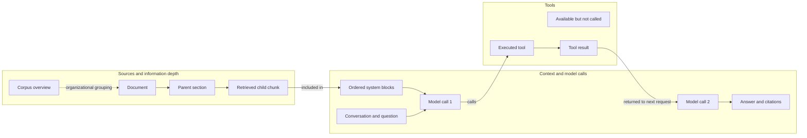

# Handoff: chatbot showcase hierarchy and turn graph

Date: 2026-09-13. Status: proposal for implementation; no UI changes made in this handoff.
Target: `/showcases/ai/chatbot`.

## Goal

Make the working chatbot the first thing a visitor encounters. After asking a question,
they should be able to see where its information came from, how deeply retrieval went,
which chunks entered context, how that context was arranged for each model call, which
tools were available and which actually ran, and what the answer cited.

The intended reading order is **ask → read the answer → explore the turn graph → inspect
content → read implementation details**. The graph is a central part of the example, with
information sources on the left, context and model calls in the center, and tools on the
right. It must make relationships understandable without requiring the visitor to read
the entire trace tree or know internal identifiers.

## What was observed in the browser

The page was inspected successfully after the development server restarted.

- The first viewport is dominated by the general AI heading, descriptions, route/client
  metadata, a horizontally scrolling navigation strip, and the beginning of Request spine.
- The long request flow precedes the small “Ask Vely live” button. There is no embedded
  conversation at the top of the showcase.
- The inspector collapses the answer while immediately showing provider, profile version,
  counts, and a timing waterfall.
- A narrow, independently scrolling tree sits beside a mostly empty detail column saying
  “Select a node to see its content.” Much of the available width contributes nothing.
- The waterfall explains timing, but neither it nor the tree visibly connects chunk
  hierarchy, context inclusion, and tool results to the answer.
- Copy is inconsistent: “Recorded demo” and “One real turn” accompany a provenance strip
  explicitly identifying an authored stand-in. The description says five tools, while
  the current tool table lists three. Derive counts and preserve truthful provenance.

## Proposed page structure

| Order | Section | Default presentation |
| --- | --- | --- |
| 1 | Chatbot example | Compact title and one sentence; embedded chat, suggested questions, visible answer, clear demo/live mode |
| 2 | Turn graph | Automatically follows the new turn; source hierarchy left, context and model calls center, tools right |
| 3 | Selected content | Appears only after selection, next to or below the graph; close returns that space to the graph |
| 4 | Implementation reference | Expandable sections for request flow, guards, prompt internals, retrieval configuration, verification, streaming, and awareness |

Replace the nine competing top-level navigation items with a small set such as Example,
Turn graph, and Implementation. Preserve existing section anchors, especially
`#orchestration`, and support existing answer links carrying `?conversation=…&turn=…`.
Technical metadata belongs in the relevant detail view or reference section.

Signed-out visitors should have a complete, clearly labeled authored or recorded example
with both answer and graph. Live chat keeps the existing sign-in and budget behavior.
Selecting a suggested live question should submit through the normal chatbot path.

## Graph design

Use a deterministic, directed layout with labeled groups and stable node positions.
Start with source groups and compact counts; expand individual documents and chunks on
demand. Keep the available tool list visible, including tools that did not run. Do not
render every prompt block, candidate body, and tool schema as an expanded card at once.

Conceptual arrangement below; arrows are shown in a real turn only when its records
support the relationship:

### Sources, chunk levels, and information depth

Distinguish three concepts visually rather than calling all of them “layers”:

| Concept | What the visitor should see |
| --- | --- |
| Content hierarchy | Source/corpus → document → parent section → child chunk, with real ancestry where recorded |
| Information granularity | Overview/map, broader parent passage, specific chunk; title/path and size clarify how much detail each carries |
| Retrieval mechanism | Vector retrieval, parent expansion, entity traversal, or other recorded stages, with whether they ran for this turn |

An overview does not necessarily produce the document retrieval query. Containment lines
must look different from execution/data-flow arrows. A stage being implemented does not
mean it ran. The inspected page labels chatbot vector retrieval as live and parent/entity
stages as not exercised here; verify the current execution before representing them.

For candidates, show considered, included, and cited states, with omitted candidates
collapsed into an expandable count. On selection show body, source path, rank/score when
available, size, inclusion or omission reason, and linked context block. Highlight the
selected item's recorded connections through context and citations.

### Whole context arrangement

The center should explain the actual model request, with an ordered context view linked
to the graph. Show the recorded system-block sequence, its stable/variable boundary,
conversation history outline, current question, and tool results entering later requests.
Use `trace.blocks` and per-call request records as the authority; do not hardcode a second
version of the prompt composition order.

Provide a model-call selector for multi-call turns. It changes which blocks and tools
were offered and identifies the preceding tool round trips. Keep definitions offered to
the model distinct from tool results returned to it. Display compaction/truncation and
dropped-history counts where recorded. Character sizes and recorded token usage must have
explicit units; do not invent token counts per block or reconstruct missing history text.

Context nodes should be readable labels first, with code identifiers available in details.
Clicking a block opens the actual recorded text when retained. This explains assembled
inputs and observable execution, not hidden model reasoning or causal influence.

### Tools and execution

Show the profile's tools on the right, and distinguish declared availability, offered in
the selected model request, called, successful, and failed. These are separate facts;
a tool being offered does not prove execution. Use labels/icons as well as color.

Show a separate execution node for each invocation, attached to its recorded model call.
Selecting it opens arguments, model-facing output, duration/status, and compaction details.
Tool output should connect to the later model request only when that relationship can be
established. Unlinked executions remain visible with an explanation. Draw consecutive
model calls separately so tool round trips have readable direction rather than overlapping
cycles. Tools never called stay visible in a compact, visually quieter inventory.

### Interaction and layout

- Selecting a node highlights its connected path and opens its detail content. No empty
  detail column is reserved before selection. Closing details restores graph width.
- Graph, optional tree view, context view, and timing view share selection and turn identity.
  Keep the tree as an accessible alternative and timing as a secondary view.
- Keep one primary page scroll. Give the graph a useful bounded viewport with fit/reset
  controls if needed; avoid large blank regions and nested scrolling for ordinary reading.
- On narrow screens, stack sources, context, and tools in reading order with the same
  selectable relationships. Essential content must work without dragging or hovering.
- Provide keyboard node selection, visible focus, textual statuses and relationships,
  reduced-motion behavior, and an accessible list/tree alternative. Use existing tokens,
  primitives, and graph infrastructure.

## Refactoring approach

Keep one turn as the source of truth. Reuse `InspectedTurn`, `TurnTrace`,
`TurnTraceSnapshot`, and the existing inspector selection IDs.

| Existing home | Proposed responsibility/change |
| --- | --- |
| `src/routes/[[locale=locale]]/(public)/showcases/ai/chatbot/+page.svelte` | Reorder into example, turn graph, reference; connect live chat and selected turn |
| `src/routes/[[locale=locale]]/(public)/showcases/ai/+layout.svelte` | Reduce introductory chrome if necessary; check the deskbot sibling before changing shared layout |
| `src/lib/components/composites/chatbot/Chatbot.svelte` and `src/lib/state/chatbot-session.svelte.ts` | Extract/reuse conversation rendering for an embedded presentation; preserve one session, transport, streaming lifecycle, and history implementation |
| AI showcase `_components/TurnInspector.svelte` | Compose the graph and context views; show `TurnItemDetail.svelte` only on selection; retain tree/timeline as alternate views |
| AI showcase `_components/turn-inspector.state.svelte.ts` | Synchronize current turn, selected call/node, loading, and live completion; protect against stale fetches when switching turns |
| `src/lib/showcases/ai/inspector.ts` | Retain shared IDs and pure projections; add a focused graph projection module if needed, after consulting `docs/naming.md` |
| `src/lib/components/viz/graph/` | Evaluate existing `DagGraph`, `TreeGraph`, and shared SVG container before adding graph infrastructure |
| `src/lib/types/turn-trace.ts` and `src/lib/server/ai/trace/` | Add only the missing trace facts required for accurate ancestry and per-call data-flow connections |

For an embedded chat, separate presentation from panel controls. Prevent the shell and
showcase from mounting competing composers or duplicating requests. Preserve session
continuity across navigation and the shell chatbot's existing behavior.

### Live synchronization

Use the submitted question's assistant-message identity throughout. Render available
progress from `message.metadata.trace`, then fetch the persisted owner-readable trace
after completion for bodies and full details. Refresh the conversation's message/turn
list even when the new answer belongs to the already selected conversation; the current
`inspect()` only refreshes that list when the conversation ID changes.

Handle persistence delay with bounded retry and a visible loading/failure state. Cancel
or ignore stale responses when the visitor switches turns. Never display the demo graph
as though it belonged to a live answer while its trace is loading or unavailable. Preserve
the user's selection of an older turn until they choose to follow the latest one.

## Data available now and gaps to address

The current contract supplies source inventories, candidate IDs/document IDs, ranks,
states, block IDs, omission reasons, ordered prompt blocks, history outlines, per-call
offered tools, executions, and citations. This supports a useful first graph.

It does **not** explicitly provide chunk parent IDs/depth, a full retrieval-stage lineage,
or a universal mapping from tool executions to returned grounding items and subsequent
request contents. `historyCount` alone cannot prove the exact tool-result membership of
a request. Check the producer and persistence paths before treating a relation as known.

Implement the complete vision by recording the necessary ancestry, stage provenance,
and membership links at their source, through the existing recorder and owner-scoped
read path. Keep these additions bounded; the graph should not require downloading the
entire corpus. Record historical relationships at execution time when needed. Current
document ancestry may be shown as current metadata, but must not silently rewrite the
account of an older turn. Missing facts should say “not recorded.”

Preserve redaction, missing-body, and content-drift states. A profile fetched today may
have changed since a historical turn: compare its version with `trace.profileVersion`,
label mismatches, and use recorded tool definitions/request lists for historical claims.
Inclusion is not proof of use; a citation is the recorded reference relationship. An
`unsurfaced` citation must not create a false connection to a retrieved chunk.

## Delivery sequence and acceptance

1. Refactor hierarchy and shared chat presentation; show a complete labeled example first.
2. Build the graph/context projection and conditional details using existing trace facts.
3. Wire live snapshots, completion reads, existing deep links, and turn switching.
4. Fill the ancestry and per-call relationship gaps through the recorder; show unknowns
   explicitly until those facts exist. This step is required for the full chunk-depth vision.
5. Move reference sections below the example and update localized copy and canonical docs.

The result is ready when:

- The first viewport makes trying the chatbot obvious; the answer is visible by default.
- A new question automatically yields the graph of that same turn without a second AI run.
- A visitor can follow a chunk's source and recorded depth into context and inspect its body.
- All available tools are discoverable, offered tools are distinguishable, and actual
  invocations visibly connect to their calls and recorded results.
- Switching model calls explains the recorded context arrangement and tool availability.
- Empty, failed, no-tool, omitted-candidate, redacted, drifted, and unavailable-trace cases
  remain readable and never fabricate an execution or relationship.
- Details consume space only when opened; desktop and mobile retain clear hierarchy.
- Signed-out demo, signed-in live chat, historical deep links, and the deskbot sibling work.

Test projection invariants (valid endpoints, unique execution IDs, accurate inclusion and
citation links, explicit unknowns), live-turn selection races, and owner isolation for any
read-path changes. Verify desktop/mobile, keyboard behavior, and real live completion in
the browser. Run relevant suites and the authoritative `podman exec v10r bun run validate`
gate for implementation work; report failures accurately. Tooling runs inside `v10r`.

## Library recommendation after repository and web review

Reviewed 2026-09-13. **Reuse Svelte Flow for rendering and interaction; use ELK.js for
automatic layout of expanded groups when needed.** This is a recommendation, not an
installed dependency change or a completed performance evaluation.

Velociraptor already declares `@xyflow/svelte` in `package.json`; `bun.lock` resolves it
to 1.5.0. `src/lib/components/viz/diagram/flow/FlowDiagram.svelte` already wraps it with
client-side loading, custom node types, controls, and design-token theme overrides.
The earlier component inventory should therefore lead with this existing wrapper.

[Svelte Flow custom nodes](https://svelteflow.dev/learn/customization/custom-nodes) are
ordinary Svelte components. That lets the graph use existing typography, badges, icons,
and interactive controls inside readable source/chunk/context/tool cards.
[Subflows](https://svelteflow.dev/learn/layouting/sub-flows) support parent/child grouping;
application code still needs to implement expansion, selection semantics, and trace mapping.

The current wrapper needs controlled selection and node-click callbacks, custom edge
support, configurable height, and appropriate viewer interaction settings. Its generic
nodes have top/bottom handles; the turn graph needs custom nodes with attachment points
appropriate to the three-column arrangement. Keep editing/connection creation disabled.
Preserve ordinary page scrolling, with deliberate zoom and a fit control.

Keep Sources, Context/model calls, and Tools in fixed semantic columns. Use deterministic
positions for the compact overview. For variable document/chunk trees, evaluate
[ELK.js](https://github.com/kieler/elkjs), whose directed layout supports explicit edge
attachment points. There is an official [Svelte Flow integration example](https://svelteflow.dev/examples/layout/elkjs).
ELK computes layout; it does not render the UI. It is not currently declared in the
repository. If added, lazy-load it, evaluate worker execution for larger layouts, and
measure the actual route bundle and expanded-trace responsiveness. Rendering ELK edge
bend points requires a corresponding custom edge implementation. Keep semantic column
placement under application control; an unconstrained global layout will not guarantee it.
Re-layout on structural expansion/change, not on every streamed status update.

| Option | Assessment for this showcase |
| --- | --- |
| Existing Svelte Flow wrapper + custom cards | Preferred: already in the stack, strong fit for rich content and inspection interactions |
| Existing `DagGraph` / `d3-dag` | Useful for compact diagrams; current implementation uses fixed 80×28 SVG nodes and internal selection, so this richer UI would require substantial extension |
| Existing `KnowledgeGraph` / `NetworkGraph` | Keep for entity relationship exploration; their network presentation does not establish the reading order this turn inspector needs |
| [Cytoscape.js](https://js.cytoscape.org/) | Capable compound graphs and graph analysis; consider for a future corpus/network explorer. For this task, the existing Svelte component renderer is a more direct fit |

For visual direction, see the official [Turbo Flow example](https://svelteflow.dev/examples/styling/turbo-flow).
Adapt its custom cards and edge styling to Velociraptor's tokens: subtle group surfaces,
clear depth breadcrumbs, restrained category accents, and brighter selected connections.
Animate only active execution paths and settle them after completion. Show around a dozen
summary cards initially, expanding documents/chunks on demand. The polish comes from
composition, readable labels, stable positions, and purposeful highlighting; choosing the
library alone does not deliver it.

## Canonical references and working-tree note

Start with [documentation navigation](README.md), [code organization](codebase-organization.md),
[runtime architecture](system-abstraction.md), and [naming](naming.md). AI contracts live in
[turn trace](blueprint/ai/turn-trace.md), [profiles](blueprint/ai/profiles.md),
[layered retrieval](blueprint/ai/layered-rag.md), [knowledge base](blueprint/ai/knowledge-base.md),
and [persistent chatbot](blueprint/ai/persistent-chatbot.md). Update those canonical sources
when implementation changes their contracts; this file is a handoff, not replacement stack
documentation.

The working tree already contains substantial uncommitted work, including AI trace,
profile, inspector-detail, translation, and retrieval changes. Recheck the current diff
before implementation and preserve it. This task adds only `docs/handoff.md`; it does not
authorize staging, committing, pushing, deployment, or a `vr` command.
